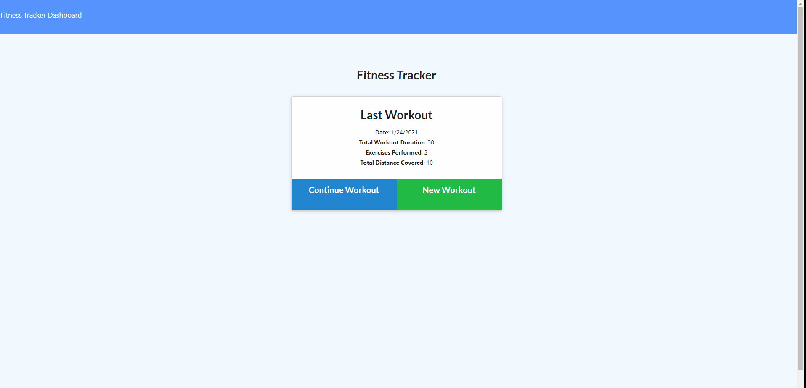

# Workout Tracker

## Description

This workout tracker app allows a user to create and track their daily workouts. They can log multiple workouts in a day, track the name of the workout, the type, weights, sets, and distance. It will also sum up the total duration spent working out. 

## Table of Contents

 * [Installation](#installation)
  * [Usage](#usage)
  * [Demo](#demo)
  * [Contact](#contact)

  ## Installation 
    1. Clone repo
    2. Install NPM packages
    
    To use this app, you will need to install the dependencies using node.js and run the seed data during development. You will also need to have MongoDB installed prior to use. 

## Usage

To use the app all you have to do is: 
* start the app
* create or continue workout
* choose type or workout - cardio or resistance
* enter in workout data

Or you can use the deployed Heroku link [here](https://workout-tracker-nd.herokuapp.com/)!

## Demo

## Contact

* Nadine Delaire :  ndelaire16@gmail.com
* Repo: https://github.com/ndelaire/workout-tracker
